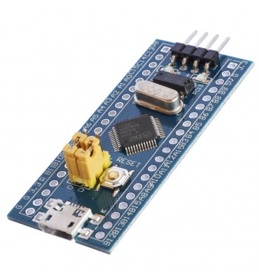
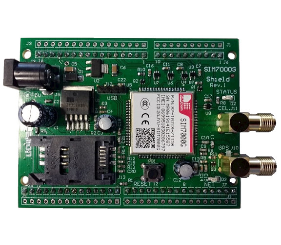
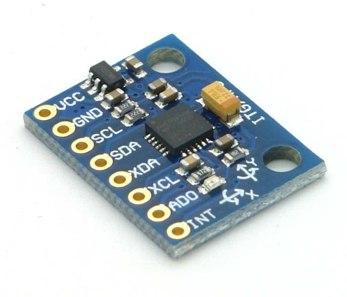
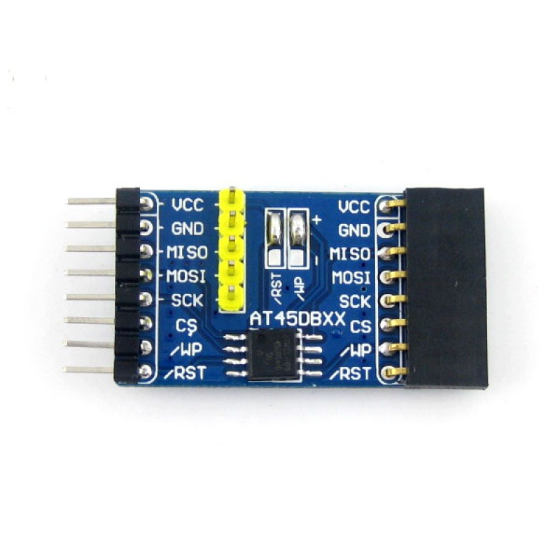
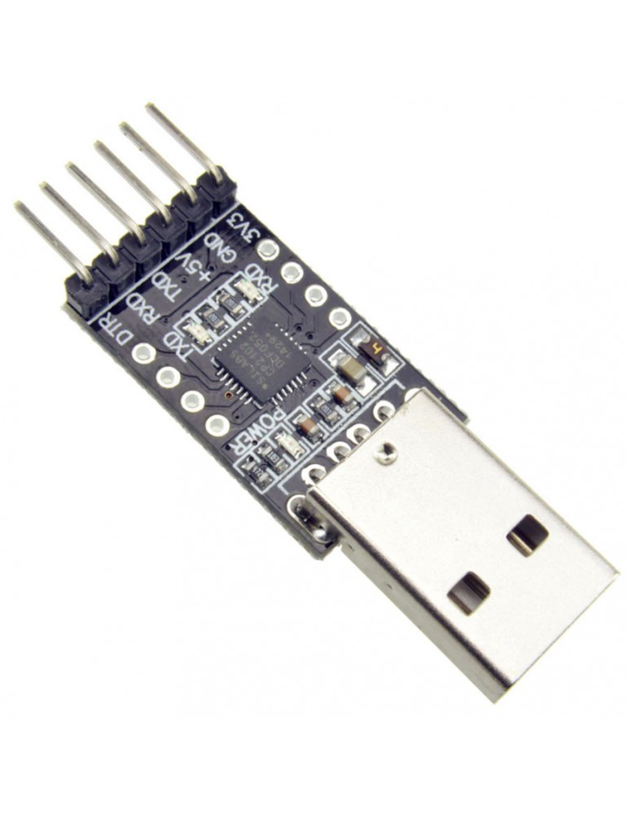

# Simo pcb

## Proyecto en construccion.

 

<h2>
    Diseño y construccion de PCB de conexion para el dispositivo drifter modular SIMO (Sistema de Monitoreo).
</h2>

## Diseñador: German Velardez

### Breve resumen del proyecto a realizar:

El proyecto consiste en el diseño y prueba de concepto de un dispositivo tipo drifter basado en una placa de desarrollo y modulos tipo arduino.
Para realizar la conexion de los distintos elementos se diseñara dos placas PCB:
*  **Simo Shield**
*  **Simo Bateria**

## Simo Shield
 PCB para interconectar los siguientes elementos:
  * **Placa de desarrollo basada en STM33F103xx** (Bluepill)
      

     
     

  *  **Modulo comunicacion 4G  diseñado por Elemon** (EESA-IOT SIM7000G PLACA SHIELD 2G/CAT-M1/NB1/GNSS)
      

       
       

  *  **Sensor acelerometro** (MPU6050)
     

       
       

  *  **Memoria flash externa para almacenar datos** (AT45DB)
     

       
       

  *  **Conector para acceso a puerto UART de debug**
     

       
       

## Simo Bateria
 Este PBC tiene como objetivo gestionar los elementos necesarios para que el dispositivo pueda funcionar con Baterias.
 PBC para interconectar los siguientes elementos:
 * **2 porta baterias 18650**
 * **Regulador Step Down (LM2596S)**
 * **Conectores de salida varios**
